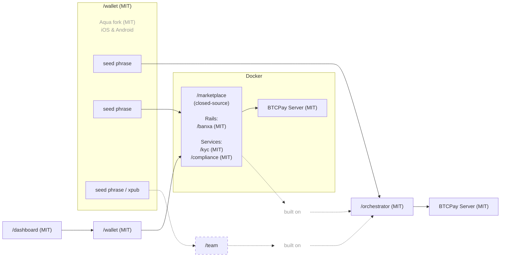

# @ara-peaha-ai/orchestrator

## Stage

Most of the repos/modules in this monorepo are ready to be tested in projects not in production stage.  

The core orchestrator will be devolped once that the first integrations are enough to define a standard of comunicnations required.  

None of the modules are meant to be used in production unless clearly mentioned in the related repo's README.md  

The reason it is public today is to find contributors and not as a mean to distribute it to be used in anything serious.

## Discalimer

We don't have affiliation with any of the services listed here and we don't mean to rapresent any of them. 

All the integration are based on public avaialble API or MCP meant to be publiccly used, with or without a registration and authentication.

## Structure

```
/
├── nuxt.config.js      root Nuxt app — loads all workspace modules
├── app.vue
├── pages/
├── server/
├── rails/              payment rail modules
├── flows/              business flow modules
├── services/           infrastructure service modules
└── utils/              shared utilities
```

## Description

**PAY** orchestrator repo for PE'AHA ecosystem. 

Most of the repos are in dual mode as a module to import in a Nuxt project or standalone as a server.

## PAY architecture

Open-source, modular, and agnostic-by-design payment infrastructure for businesses and users that need practical multi-rail payment flows, self-custodial settlement, and more flexible cross-border money movement. It is built around **inbound rails**, **multi-rail offramps**, and self-custodial settlement, especially where traditional payment access is fragmented, limited, or overly dependent on a single provider.

PAY uses [BTCPay Server](https://github.com/btcpayserver/btcpayserver) as the backend and an [Aqua Wallet](https://github.com/AquaWallet/aqua-wallet) fork as the default settlement wallet.

[BTCPay Server](https://github.com/btcpayserver/btcpayserver) was chosen because it is a battle-tested, widely adopted, and community-maintained API and GUI backend with some built-in rails. We also actively contribute to its [core and plugin ecosystem](https://github.com/search?q=involves%3Alearntheropes+%28org%3Abtcpayserver+OR+org%3Abtcpayserver-tether+OR+org%3Amempool%29&type=issues).

[Aqua Wallet](https://github.com/AquaWallet/aqua-wallet) was chosen because it already supports settlement in **BTC on-chain and multiple stablecoins (USD and BRL for now)** by default, and can be integrated from BTCPay Server through the Shamrock protocol with a QR-based connection flow.

Where direct local cashout is not yet native, PAY provides practical guidance around compatible external wallets, cards, and off-ramp tools to improve real usability in Latin America and other supported regions. For instance, across all currently planned settlement chains, we already consider wallets and services such as [Belo](https://simple.belo.app/app/referral?referralCode=GIOVANNIL), [Revolut](https://revolut.com/referral/?referral-code=giovanni_learntheropes), and [Offramp](https://app.offramp.xyz/login?referralCode=njmlxf), including card and Google Pay / Apple Pay compatible paths, while more privacy-friendly card and Google Pay options may later be added through planned FixedFloat API work or collaboration with the issuer.

If an inbound rail does not already settle into an asset supported by the Aqua wallet fork, PAY aims to convert it further into the supported asset that is cheapest and most functional for that case.



> Closed-source repo code is only available to team members and not to external collaborators.  
> Some modules that only work with the closed-source repo may be open-sourced at a later stage for integration into third-party external and unrelated projects.  
> Because it is a closed-source repo, it requires enhanced verification for the marketplace admin and for users involved in high-value transactions.  
> It is also supposed to generate enough income to maintain all the MIT repos long-term.  

### Inbound multi-rails

| Rail | Status | Currency | Payment Methods | Settlement | Fee | Verification | Privacy |
|------|--------|----------|-----------------|------------|-----|--------------| ------- |
| BTC | Implemented | SATS | On-chain & Lightning | Bitcoin On-chain | None | None | Total |
| USDT | Implemented | USD | Liquid & Polygon | USDT Liquid & Polygon | None | None | Total |
| [Peach](rails/peach) *(p2p-api-integration)* | testing | Global | Any | Bitcoin On-chain | High | None | Total |
| [RoboSats](rails/robosats) *(p2p-api-integration)* | testing | Global | Any | Bitcoin On-chain | High | None | Total |
| Mostro *(p2p-api-integration)* | evaluating | Global | Any | Bitcoin On-chain | High | None | Total |
| Guardarian *(cex-api-integration)* | planned | USD, EUR, GBP, CAD, AUD, JPY, TRY, PLN, SEK | Credit/Debit Cards & Google/Apple Pay | Bitcoin On-chain | Medium | None or Standard | Possible (with RUC structure) |
| Paygate *(cex-api-integration)* | planned | Global | Credit/Debit Cards | USDT Polygon | Medium | none | Total |
| DePix *(cex-api-integration)* | planned | BRL | Pix | BRL on Liquid | Low | None | Total |
| Kamipay *(cex-api-integration)* | planned | BRL | Pix | USDT Polygon | Low | Standard | None |
| MtPelerin *(cex-api-integration)* | planned | EUR & CHF | SEPA | Bitcoin On-chain OR USDT Polygon | Low | Enlached | Possible (with RUC structure) |
| Bitzed *(cex-api-integration)* | planned | ZMW | Mobile | Bitcoin On-chain | Low | None | Total |
| Matbea *(cex+p2p-api-integration)* | planned | RUB | Yandex Pay, Sberbank, Tinkoff, YooMoney, SBP P2P, Mobile phone | Bitcoin On-chain | Low | None | Total |
| MoonPay ACH USD *(cex-api-integration)* | designing | USD | ACH | TBD | TBD | Standard | None |

### Multi-rail offramp

| Cashout | Status | Currency | Payment Methods | Verification |
|---------|--------|----------|-----------------|--------------|
| Freedomia Card | under discussion with the provider | USD limited settlements | card / Google Pay | None |
| todo | ... | ... | ... | ... |

Referral code for two months of the [Freedomia](https://www.freedomia.io/a/paguaitu) free plan.

### Planned services

- **invoice**: programmatic electronic invoice generation upon payment settlement, based on the [Invopop](https://www.invopop.com/) solution, releasing the Paraguayan SIFEN integration using the available [TIPS SA](https://github.com/TIPS-SA) modules, with multiple LATAM countries supported. Disabled by default.

### Planned repositories

- **/wallet**: an MIT fork of the Aqua Flutter Wallet, with an embedded Nuxt app to manage /orchestrator settings and connect to BTCPay via the Shamrock protocol.
- **/dashboard**: Nuxt-based MIT app intended to handle payment flows through an embedded interface in the /wallet Flutter app.
- **/marketplace**: closed-source repository for multi-user marketplace integrations of this repo. Multi-user management by the marketplace admin, while funds always remain under the control of the marketplace merchant user. Modules under evaluation:
  - Rails: [Banxa virtual accounts](https://banxa.com/features/fiat/virtual-accounts/), ACH, SEPA, Faster Payments, and PayID rails, all to be confirmed due to poor documentation, with merchant-unique details.
  - Services: merchant KYC verification; financial operations reporting for Paraguayan clients as required by the Resolución DNIT 47/2026 compliance rules; financial operations reporting for EU clients as required by the MiCA regulation.

### Use cases

PAY is aimed at cases where standard payment stacks are too limited, too fragile, or too dependent on a single provider:

- cross-border businesses
- businesses that need multi-rail inbound payments
- merchants that want crypto settlement with broader payment reach
- users in emerging markets
- high-risk but lawful businesses
- builders that want modular, self-hostable payment infrastructure
- Bitcoiners

It is not meant to be presented as a universal fit for every merchant.

Project inspired by [**BitPagos**](https://web.archive.org/web/20141225131358/https://www.bitpagos.com/es/) in 2014, now prioritized as an open-source response to the recent release of a KYC-mandatory, limited-availability, fiat-settled [Stripe Payments BTCPay Plugin](https://plugin-builder.btcpayserver.org/public/plugins/stripe-payments).

## What exists today

### PAY

Payment rails, business flows, and support services and models/api/mcp/cmd integrations into a single Nuxt-based workspace.

P2P market aggregated order book, on web or tor.

Robosats and Peach autnetication and all the needed endpints to run the flow.

They both come with tradeoff:

Robosats requires a Bond on LN. When completed it is meant to be used for returning clients with the bond approved and paid by the merchant.

While Peach requires to import and existing keypairs of an account with trading history to have all the needed functionalties.

Mostro is the next high-priority integration. In theory, it addresses both issues above.

Bisq has not been yet even evaluated and it is mentioned here as a note.

#### Rails  

Payment rail modules. Each injects pages, composables, and server handlers into the host app, and can also run standalone as a Nitro server.

| Package | Page | API |
|---------|------|-----|
| `@ara-peaha-ai/template` (`rails/template`) | `/rails/template` | `/api/rails/template` |
| `@ara-peaha-ai/peach` (`rails/peach`) | `/rails/peach` | `/api/rails/peach/*` |
| `@ara-peaha-ai/robosats` (`rails/robosats`) | `/rails/robosats` | `/api/rails/robosats/*` |

#### Flows

Higher-level feature modules with pages and UI components.

| Package | Pages |
|---------|-------|
| `@ara-peaha-ai/booking` (`flows/booking`) | `/flows/booking`, `/flows/booking/embed` |

#### Services

Infrastructure modules that run as both a standalone Nitro app and an embeddable Nuxt module.

| Package | Routes | Notes |
|---------|--------|-------|
| `@ara-peaha-ai/ip` (`services/ip`) | — | Rate limiting + IP geolocation (country, currency) + Cloudflare vs IPinfo deduction (VPN, Proton Smart Routing, Tor), disabled by default |
| `@ara-peaha-ai/tor` (`services/tor`) | `/api/tor`, `/api/tor/**` | Tor reverse proxy, disabled by default |
| `@ara-peaha-ai/market` (`services/market`) | `/api/market/**` | P2P offer aggregator (Bisq, RoboSats, Peach), disabled by default |
| `@ara-peaha-ai/risk` (`services/risk`) | `/api/risk/**` | Consent-based risk and trust profiles: social, face match, AI-generated images, IP, BTC proof of funds. Node only, disabled by default |

## Local development

```bash
pnpm install
pnpm dev
pnpm build
pnpm preview
```

## Module loading

The root Nuxt app (`nuxt.config.js`) lists workspace modules in the `modules` array. Each module auto-registers its pages, composables, and server handlers when the app starts. Adding a module requires two changes:

1. Add `"@ara-peaha-ai/<name>": "workspace:*"` to root `package.json` dependencies
2. Add `'@ara-peaha-ai/<name>'` to the `modules` array in `nuxt.config.js`

`flows/booking` requires `@nuxt/ui`. It must be present in `nuxt.config.js` before or alongside the booking module.

## Environment variables

### `services/tor`

| Variable | Required | Default | Description |
|----------|----------|---------|-------------|
| `NUXT_TOR_PROXY_SECRET` | yes | — | Shared secret sent in `X-Tor-Proxy-Secret` header |
| `NUXT_TOR_SOCKS_URL` | no | `socks5h://127.0.0.1:9050` | SOCKS5h URL of the local Tor daemon |

### `rails/robosats`

| Variable | Required | Default | Description |
|----------|----------|---------|-------------|
| `NUXT_ROBOSATS_COORDINATOR_URL` | no | RoboSats default onion | Coordinator onion base URL |
| `NUXT_TOR_PROXY_SECRET` | yes | — | Shared secret for the embedded `@ara-peaha-ai/tor` proxy |
| `NUXT_TOR_SOCKS_URL` | no | `socks5h://127.0.0.1:9050` | SOCKS5h URL of the local Tor daemon |

### `rails/peach`

| Variable | Required | Default | Description |
|----------|----------|---------|-------------|
| `NUXT_PEACH_BASE_URL` | no | `https://api.peachbitcoin.com` | Peach API base URL |
| `NUXT_PEACH_BITCOIN_MNEMONIC` | yes | — | BIP39 mnemonic for wallet key derivation |
| `NUXT_PEACH_PGP_PRIVATE_KEY` | yes | — | Armored PGP private key |
| `NUXT_PEACH_PGP_PUBLIC_KEY` | yes | — | Armored PGP public key |
| `NUXT_PEACH_PGP_PASSPHRASE` | yes | — | PGP key passphrase |
| `NUXT_PEACH_REFERRAL_CODE` | no | — | Peach referral code |
| `NUXT_PEACH_FEE_RATE` | no | `hourFee` | Bitcoin fee rate strategy |
| `NUXT_PEACH_MAX_PREMIUM` | no | `0` | Maximum accepted offer premium |

### `services/ip`

| Variable | Required | Default | Description |
|----------|----------|---------|-------------|
| `NUXT_IP_DETECTION_CURRENCY` | no | `false` | Expose currency derived from Cloudflare `cf-ipcountry` header in `event.context.ipDetection` |
| `NUXT_IP_DETECTION_COUNTRY` | no | `false` | Expose country code in `event.context.ipDetection` |
| `NUXT_IP_DETECTION_CLOUDFLARE_SECRET` | no | — | Shared secret to verify requests come through Cloudflare. Set the same value as the `x-cf-origin-token` header in a Cloudflare Transform Rule. Without this, CF headers are trusted automatically. |
| `NUXT_IPINFO_API_KEY` | no | — | IPinfo API key. Enables `countryIPinfo` and `currencyIPinfo` as additional properties. Free lifetime key available at [ipinfo.io](https://ipinfo.io). |
| `NUXT_IP_DETECTION_RATE_LIMIT` | no | `100` | Max requests per IP per minute |
| `NUXT_IP_DETECTION_LIMIT_PATHS` | no | — | Comma-separated list of API paths to rate-limit. If empty, all `/api/*` paths are limited. |

### `services/market`

| Variable | Required | Default | Description |
|----------|----------|---------|-------------|
| `NUXT_TOR_PROXY_SECRET` | yes | — | Auth secret for the inline Tor proxy handler |
| `NUXT_ROBOSATS_COORDINATOR_ONION_URL` | no | RoboSats default onion | RoboSats coordinator onion address |
| `NUXT_TOR_SOCKS_URL` | no | `socks5h://127.0.0.1:9050` | SOCKS5h URL of the local Tor daemon |

## Known issues

- `@nuxt/kit` version mismatch: `rails/peach`, `rails/robosats`, and `services/tor` declare `@nuxt/kit ^3.13.0` while the root app and `rails/template`, `flows/booking` use `^4.0.0`. The modules work in module mode via Nuxt's own kit instance, but full standalone migration to `^4.0.0` is pending.
